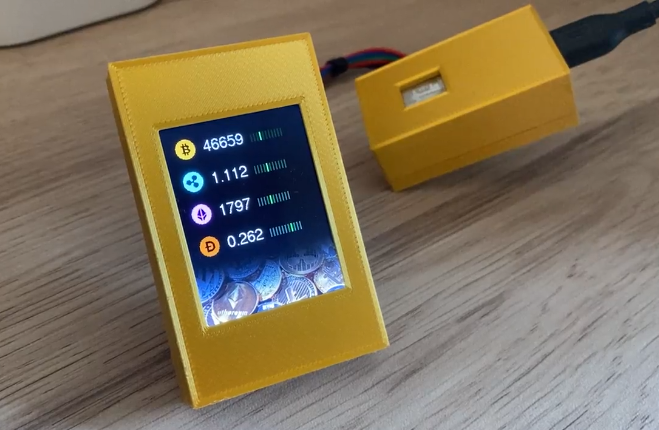
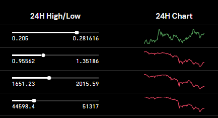

# LCD ILI93 Cryptocurrency price tracker display
Tiny display listing your favorite cryptocurrencies prices with real-time data.


## Demo
Video available on [my reddit post](https://www.reddit.com/r/Bitcoin/comments/mtead3/cheap_tiny_display_i_made_to_track_bitcoin_other/)
[](https://www.reddit.com/r/Bitcoin/comments/mtead3/cheap_tiny_display_i_made_to_track_bitcoin_other/)

## Requirements

**Disclaimer:** I made the project public because some reddit users asked me to. Code is far from perfect, it's a prototype but it works.


### Components
- [ESP8266 NodeMCU](https://www.amazon.com/HiLetgo-Internet-Development-Wireless-Micropython/dp/B081CSJV2V/)   
- [ILI9341 TFT LCD Display 240x320](https://www.amazon.com/Hailege-ILI9341-Display-240x320-Raspberry/dp/B08D7D14X9/)  


### Libraries
```
ESP8266WiFi
  
ESP8266HTTPClient  
ArduinoJson  
  
Adafruit_GFX  
Adafruit_ILI9341
```

### Ressources
- `Arduino` software
- A webserver to feed exchanges prices (see [API](#API)).

## Install

### Wiring

Taken from [simple-circuit.com](https://simple-circuit.com/esp8266-nodemcu-ili9341-tft-display/) tutorial

### Code

- Connect your `ESP8266` to your computer and open `Arduino` software
- Install the required libraries: `ESP8266WiFi`, `ESP8266HTTPClient`, `ArduinoJson`, `Adafruit_GFX`, `Adafruit_ILI9341`
- Rename `config.h.example` to `config.h` and edit its content to fit your WIFI connection and API url
- Create a webserver that serv a JSON containing prices data (see [API](#API))
- Compile & Upload

### API

A webserver is required to get exchanges prices & it needs to be able to serve content without ssl. You can get prices with [Kraken Public API](https://www.kraken.com/features/api), it's free.

#### Response example

```json
{
  "xbt": 46568,
  "xrp": 1.117,
  "eth": 1816,
  "xdg": 0.258,
  "xbt_point": 3,
  "xrp_point": 4,
  "eth_point": 5,
  "xdg_point": 7
}
```

`_point` keys are the position on a 10 point scale where the current price is on the past 24h min/max values. Similar to what Kraken does (24H High/Low):




# Donate <3

BTC `bc1q6wcj88z9fflpa9xwcd5360ut99r954vc6g238n`   
DOGE `DNYUTvkM8MJgD7sjihX8AVVgxPndK82DCN`


